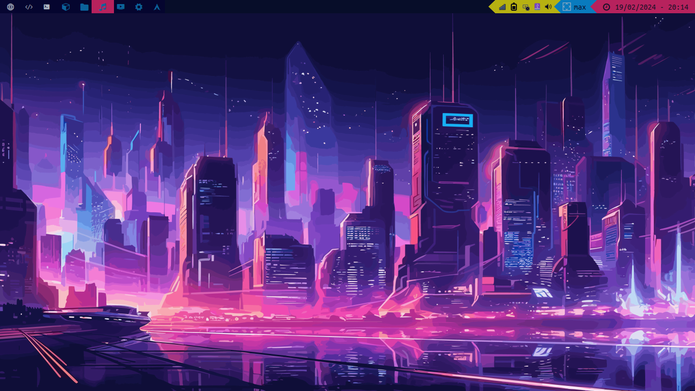
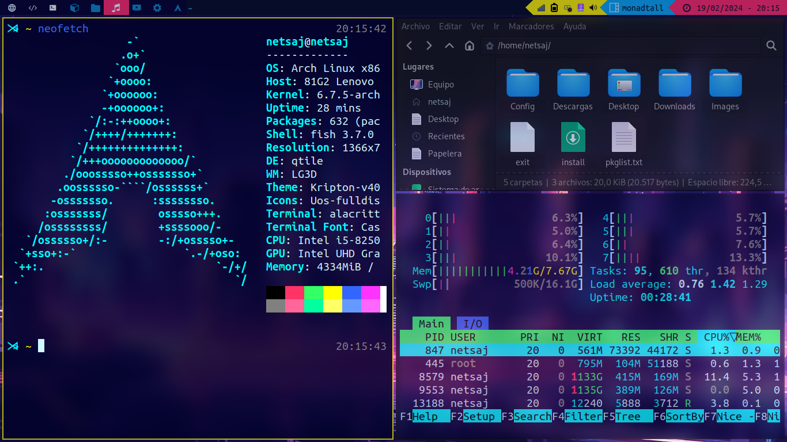
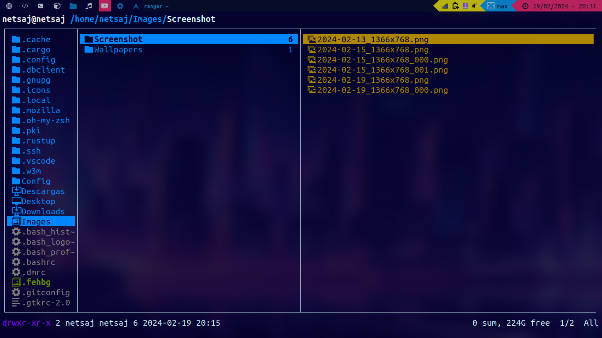
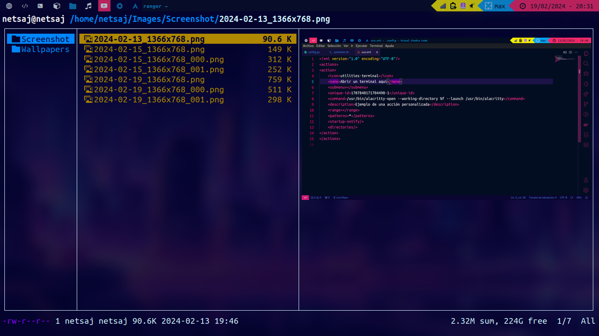
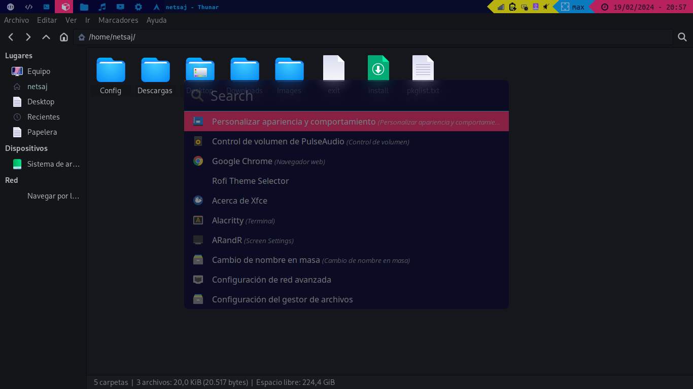

# Configuraciones Cyberpunk para Arch Linux

Este repositorio contiene mis configuraciones personalizadas para mi sistema Arch Linux con un tema inspirado en el estilo cyberpunk.



## Contenido

- **.config**: Directorio que contiene las configuraciones de varias aplicaciones, como gestores de ventanas, navegadores, editores de texto, etc.
- **.xprofile**: Archivo de configuración del perfil X que se ejecuta al iniciar sesión en X11. Contiene ajustes de configuración del entorno de escritorio y variables de entorno.
- **themes**: Directorio que almacena los temas personalizados para diferentes aplicaciones y componentes del sistema.
- **pkglist.txt**: Lista de paquetes instalados desde los repositorios oficiales de Arch Linux.
- **pkglist-aur.txt**: Lista de paquetes instalados desde el AUR (Arch User Repository).


## Qtile (Administrador de Ventanas)

En esta configuracion de Arch se utilizara Qtile como administrador de ventas



## Uso

Puedes usar estos archivos y configuraciones en tu propio sistema Arch Linux si deseas experimentar con un tema cyberpunk o simplemente para inspirarte en cómo personalizar tu propio entorno.

### Instalando los paquetes

Si quieres instalar los paquetes listados en `pkglist.txt` en tu sistema, puedes usar los siguientes comandos:

#### Oficiales
Para instalar paquetes desde los repositorios oficiales de Arch Linux:
```
pacman -S - < pkglist.txt
```
Si deseas omitir la instalación de paquetes ya instalados, puedes usar la opción `--needed`:
```
pacman -S --needed - < pkglist.txt
```
#### AUR

Para instalar paquetes desde el Arch User Repository (AUR) usando `yay`:
```
yay -S - < pkglist-aur.txt
```

### Configuración de Temas de Iconos, Cursores y del Sistema

En este repositorio también encontrarás temas para los íconos, cursores y el tema general del sistema. Sigue estos pasos para configurarlos en tu sistema Arch Linux:

### Descomprimir los archivos tar.gz

1. Navega hasta la carpeta correspondiente a los temas (Icons, Cursors, System).
2. Encuentra el archivo tar.gz del tema que deseas instalar.
3. Descomprime el archivo tar.gz. Puedes hacerlo ejecutando el siguiente comando en tu terminal:

```
tar -xzvf your_theme.tar.gz
```

### Instalar el tema de íconos

1. Después de descomprimir el archivo tar.gz del tema de íconos, ejecuta el siguiente comando en tu terminal para copiar el tema a la carpeta de íconos del sistema:

```
sudo cp -r Your_Icon_Theme/ /usr/share/icons/
```

2. Reemplaza `Your_Icon_Theme` con el nombre de la carpeta del tema de íconos que descomprimiste.

### Instalar el tema de cursores

1. Después de descomprimir el archivo tar.gz del tema de cursores, ejecuta el siguiente comando en tu terminal para copiar el tema a la carpeta de cursores del sistema:

```
sudo cp -r Your_Cursor_Theme/ /usr/share/icons/
```

2. Reemplaza `Your_Cursor_Theme` con el nombre de la carpeta del tema de cursores que descomprimiste.

### Instalar el tema de Thunar (Explorador de archivos)

1. Después de descomprimir el archivo tar.gz del tema de Thunar, ejecuta el siguiente comando en tu terminal para copiar el tema a la carpeta de temas del sistema:

```
sudo cp -r Your_Thunar_Theme /usr/share/themes/
```

2. Reemplaza `Your_Thunar_Theme` con el nombre de la carpeta del tema de Thunar que descomprimiste.

### Seleccionar el tema

Finalmente, para seleccionar los temas de íconos, cursores y el tema general del sistema, puedes utilizar el programa `lxappearance`. Ejecuta `lxappearance` en tu terminal y podrás seleccionar y aplicar los temas que desees desde la interfaz gráfica.

Espero que estos pasos te ayuden a personalizar la apariencia de tu sistema Arch Linux con los temas proporcionados en este repositorio. Si tienes alguna pregunta o necesitas más ayuda, ¡no dudes en preguntar!

## Images









## Contribuciones

Si tienes sugerencias de mejoras o nuevas configuraciones que podrían agregarse, ¡no dudes en contribuir! Siéntete libre de enviar un pull request o abrir un issue con tus ideas.

## Agradecimientos

Agradezco a la comunidad de Arch Linux por proporcionar una base sólida para construir y personalizar mi sistema operativo.

## Licencia

Este proyecto está bajo la Licencia MIT. Consulta el archivo LICENSE para obtener más detalles.
